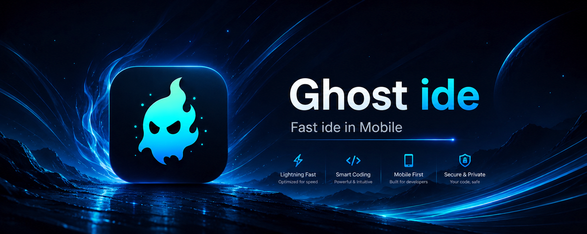

# Ghost IDE 👻


<p align="center">
  
</p>

<p align="center">
  Fast IDE for Mobile Developers
</p>


[](https://github.com/HanzoDev30/Ghostide/releases)
[](https://github.com/HanzoDev30/Ghostide/releases/latest)
[](LICENSE)
[](https://t.me/ghost_web_ide)


## 📖 Overview

Ghost IDE is an advanced mobile development environment built for Android developers, web developers, and scripting workflows. Unlike many mobile editors, Ghost IDE provides real tooling and compiler integrations directly inside the application.


> [!WARNING]
> Ghost IDE requires **Android 11 or higher** to run.
> Android versions below Android 11 are **not supported**.


**Core Focus Areas:**
- ⚡ High-performance editing
- 🧩 Rich language support
- 🔧 Integrated compilers and runtime tools
- 🎨 Deep customization
- ⌨️ Physical keyboard workflows
- 💻 Modern editor experience

---

## ✨ Features

### 🖊️ Editor
- [x] Blazing-fast code editor engine
- [x] Syntax highlighting
- [x] Auto-save functionality
- [x] Multi-tab support
- [x] Code formatting(Auto format code by lsp service)
- [x] Snippets support
- [ ] Physical keyboard shortcuts
- [x] Large file handling(Page)
- [x] Custom themes
- [x] Background customization
- [x] Lsp

### 🛠️ Development Tools
- Python execution 
- PHP execution 
- Kotlin compiler
- Java helper tools 
- Sass / SCSS / Less compilers 
- TypeScript / TSX / JSX support 
- JavaFX compiler
- Git integration
- HTML preview support 
- FTP
- SFTP
- SMB

# Lsp 

- how in install lsp? [click](https://github.com/HanzoDev30/GhostIde/blob/main/Lsp.md)
- نحوه نصب زبان سرور فارسی [click](https://github.com/HanzoDev30/GhostIde/blob/main/Lspfa.md)

## Terminal 

- Note
  - If for some reason Debian packages are not installed, try this code.

```shell

rm -f /etc/resolv.conf
echo "nameserver 8.8.8.8" > /etc/resolv.conf

```

### 🌐 Supported Languages

- [x] html
- [x] css
- [x] cpp
- [x] js
- [x] python
- [x] json
- [x] markdown
- [x] sass scss
- [x] java
- [x] c
- [x] xml
- [x] kotlin
- [x] typescript
- [x] toml
- [x] gradle
- [x] yaml
- [x] lua
- [x] dart
- [x] charp
- [x] sql
- [x] go
- [x] php
- [x] tsx & jsx
- [x] rust
- [x] shell
- [x] ini
- [x] ruby
- [ ] javacc
- [x] vue
- [ ] cmake
- [x] antlr
- [x] swift 
- [x] scala
- [x] perl
- [x] julia
- [x] r
- [x] elixir
- [x] haskell
- [x] nim
- [x] solidity
- [x] asm

---

### Preview

- [x] HtmlPreview
- [x] ImagePreview
- [x] LinkPreview


## 🎨 Theme Engine

The editor supports deep UI customization, including:
- [x] Syntax colors
- [x] Backgrounds and tab styles
- [x] Autocomplete appearance
- [x] Bracket-level coloring
- [x] Selection styles

### Make your own theme

- 📘 English guide — [click here to learn how to create a theme](https://github.com/HanzoDev30/GhostIde/blob/main/ThemeMakerEn.md)
- 📙 راهنمای فارسی — برای ساخت تم [اینجا کلیک کنید](https://github.com/HanzoDev30/GhostIde/blob/main/ThemeMakerFa.md)

> Create a theme quickly: copy any `.gth` file, rename it, open it in the File Manager and choose **Edit**. The Theme Editor's 4 tabs (Activity · Editor · Widget · M3Color) let you pick every color visually.

---
## 🚀 Why Ghost IDE?

- [x] Lightweight and fast
- [x] Built natively for Android
- [x] Real compiler integrations
- [ ] Plugin-ready architecture(hard mod)
- [x] Material Design interface
- [x] Fully open source
- [x] Optimized typing experience
- [x] Powerful customization system

---

## Code Runer🔥🔥🔥

### Note

- Installing packages may take a while, it varies on different mobiles. The system we use is Debian.
- To make it easier to work, it is better to learn to work with the Debian operating system so that you do not encounter problems because the best option for Android is Debian.

- [x] c
- [x] cpp
- [x] python
- [x] php
- [x] lua 
- [x] nodejs
- [x] typesctipt
- [x] go lang


## Plugin 

- how in install Plugin? [click](./Plugin.md)
- نحوه پیاده سازی پلاگین [click](/Pluginfa.md)
